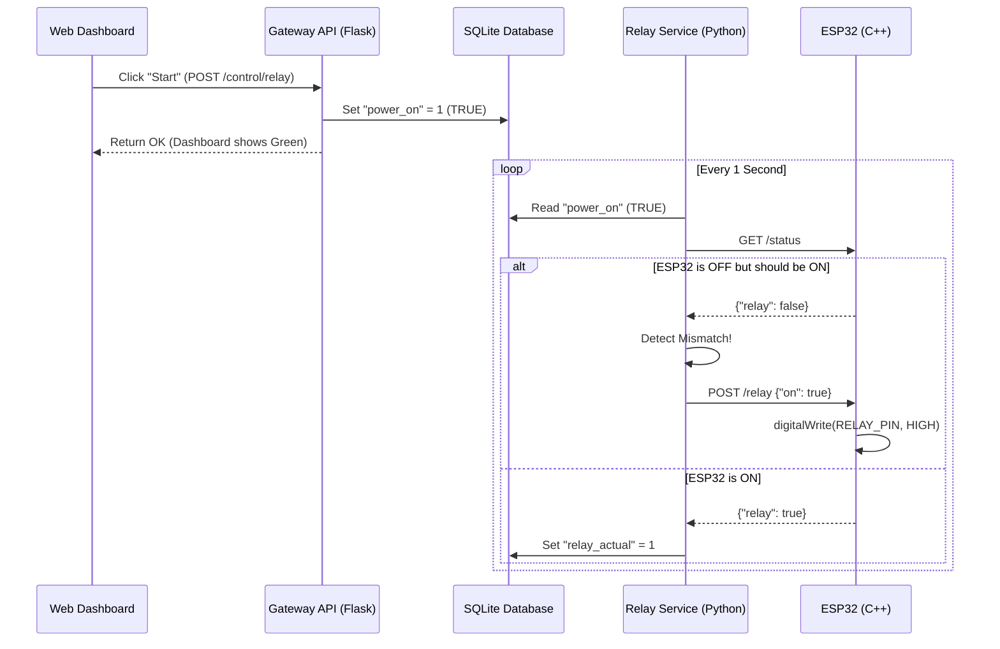

# ESP32 Relay Control Architecture

This document explains how the Web Interface controls the ESP32 Relay (Power Control) via the Orange Pi Gateway.

## Architecture & Data Flow

## How It Works

1.  **Command (Web -> Gateway)**:
    -   When you click "Start", the Web App sends a request to the Orange Pi API.
    -   The API **only** updates the `gateway.db` database. It sets the desired state `power_on` to `1`.
    -   This ensures the "intent" is saved immediately, even if the ESP32 is offline.

2.  **Execution (Gateway -> ESP32)**:
    -   The `gateway-relay.service` runs in a continuous loop (every 1 second).
    -   It compares the **Desired State** (from DB) with the **Actual State** (polled from ESP32).
    -   If they don't match, it sends a command to the ESP32 to enforce the desired state.

3.  **Feedback (ESP32 -> Web)**:
    -   The `gateway-relay.service` updates the database with the *actual* confirmation from the ESP32 (`relay_actual`).
    -   The Web App polls the API every second to update the UI color (Green/Red).

## Troubleshooting "Turn On then Off" Issue

If the relay turns ON for a second and then turns OFF, it usually means:

1.  **Brownout (Most Likely)**: The ESP32 tries to energize the relay. This draws a spike of current. If the power supply is weak, the voltage drops, and the **ESP32 reboots**.
    -   **Result**: ESP32 reboots -> Defaults to OFF.
    -   **Gateway**: Sees it's OFF, tries to turn it ON again. -> Loop.

2.  **Status Mismatch**: The Gateway thinks it should be OFF.
    -   Check `gateway-relay` logs for `State Mismatch` messages.
