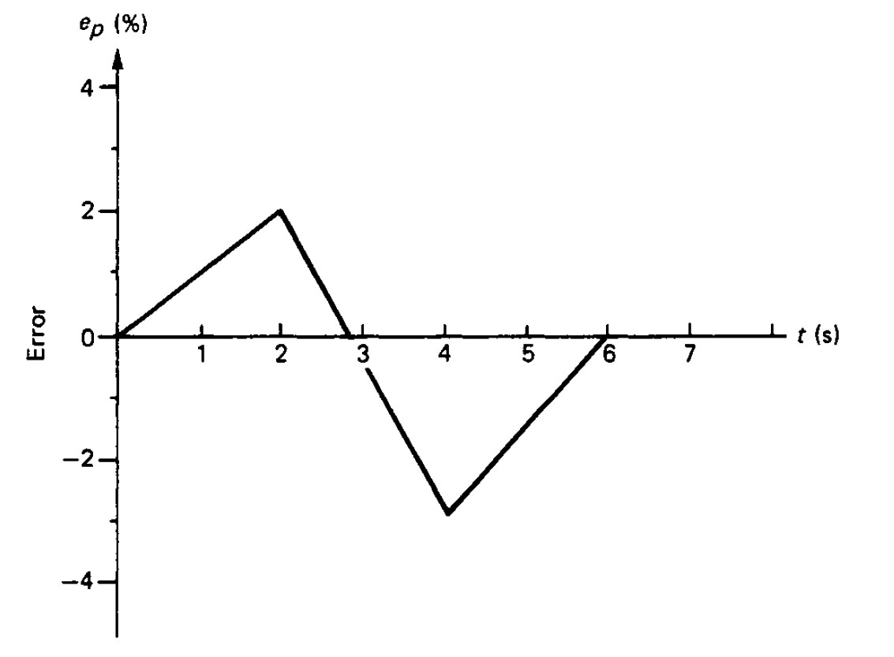

# Lab 4: PID Tuning - Open-Loop Transient Response Method

## 1. Objective
The goal of this lab is to determine the PID parameters ($K_p$, $T_i$, $T_d$) of a temperature control system using the **Open-Loop Transient Response Method** (also known as the **Process Reaction Curve Method**).

---

## 2. Pre-lab Task (10 marks)

**Instructions**: Complete these tasks before your scheduled lab session. Show your working clearly.

### 2.1 Proportional Controller Analysis (5 Marks)
A proportional controller has a proportional gain, **$K = 2.0$**, and a bias, **$p = 0.5$**. 
Determine the controller output ($P$) over time when the error signal shown below is inputted to the controller.

*Recall the formula: $P = K \cdot e + p$*

### 2.2 Theoretical ZN Tuning (5 Marks)
An open-loop step response of a process is given in the figure below when a step change of **7.5%** in the control variable (MV) is applied.

Using the Open-Loop Transient Response Method, determine the appropriate parameters for a **PID Controller** (i.e., $K_p$, $T_i$, and $T_d$).

---

## 3. Background

### 3.1 Lab Setup & Remote Architecture
Before starting the experiment, it is important to understand how your commands reach the physical hardware in the laboratory. This remote setup allows you to interact with industrial-grade equipment from anywhere.

**System Components**:
- **Web Dashboard**: Your user interface for real-time monitoring and control.
- **Cloud Worker**: A secure bridge that routes your dashboard commands.
- **Orange Pi Gateway**: Centrally manages data flow locally.
- **Hardware Core**: Omron NJ301 PLC, Radxa Camera, and ESP32 Smart Relay.

### 3.2 The Open-Loop Technique
In an open-loop test, the controller is set to **Manual Mode**. A sudden step change is applied to the Manipulated Variable (MV), and the resulting response of the Process Variable (PV) is recorded.

### 3.3 Understanding Process Gain ($K$)
- **0% MV** leads to a steady-state temperature of **27°C** (Ambient).
- **100% MV** leads to a steady-state temperature of **130°C**.
- **Process Gain ($K$)**: $K = \frac{\Delta PV}{\Delta MV}$
- Knowing the full range (**103°C**) helps in normalizing the response.

---

## 4. Measurement Tasks

### 4.1 System Readiness Check
1.  **Dashboard Overview**: Familiarize yourself with the interface shown below.
    
2.  **Verify Connectivity**: Look at the **System Status** badges. Both **Gateway** and **ESP32** must be **ALIVE**.
3.  **Troubleshooting**: Contact: `wong.kiing.ing@curtin.edu.my` or WhatsApp `0128789001`.

### 4.2 Powering Up
1.  **Process Power**: Click **Start** in the Process Power section.
2.  **Camera**: It takes ~1 minute for the camera to come online.
3.  **Light Test**: Toggle the **Light Control** while watching the video to confirm real-time control.

### 4.3 Thermal Experiment
1.  **Web Control**: Click **Start** to enable PLC communication.
2.  **Manual Initialization**: Set mode to **Manual** and MV to **40%**.
3.  **Steady State**: Wait for the temperature to stabilize at 40% MV.
4.  **The Step Change**: Change MV to **45%** (a 5% step) and click **Start**.
5.  **Data Export**: Wait for stabilization at 45% MV, then click **CSV** to download the data.

---

## 5. Post Laboratory Task (10 marks)

### 5.1 Processing the recorded data (5 Marks)
1.  **Time Conversion**: In Excel, convert raw time data (column D) to seconds using: `=(D_current - D_start)/(1e9)`.
2.  **Smoothing**: Create a moving average (100 samples) to smooth the temperature signal: `=AVERAGE(F23:F123)`.
3.  **Plotting**: Plot Temperature Response and Input Current on the same graph. Use a **Secondary Axis** for temperature to clearly see both signals.

### 5.2 Determination of PID control parameters (5 Marks)
1.  **L and N Determination**: From your smoothed graph, draw a tangent at the inflection point to find $L$ (Dead Time) and $N$ (Reaction Rate/Slope).
2.  **Power Step ($\Delta P$)**: Calculate the change in heating power as a percentage of the system's maximum (**11.52 W**).
3.  **Temp Change ($\Delta C$)**: Express the temperature change as a percentage of the **103°C range**.
4.  **Tuning**: Calculate $K_p, T_i, T_d$ for P, PI, and PID modes using the Ziegler-Nichols formulas.

---

## 6. Omron NJ301 PLC Implementation

### 6.1 PLC Conversion
The PLC uses **Proportional Band ($PB$)**. Convert your calculated $K_p$ using:
$$PB = \frac{100}{K_p}$$

### 6.2 Summary Checklist
1. [ ] Reach steady state at 40% MV.
2. [ ] Step to 45% MV.
3. [ ] Calculate $K_p, T_i, T_d$ from the captured S-curve.
4. [ ] Test your PID values in **Auto Mode**.
