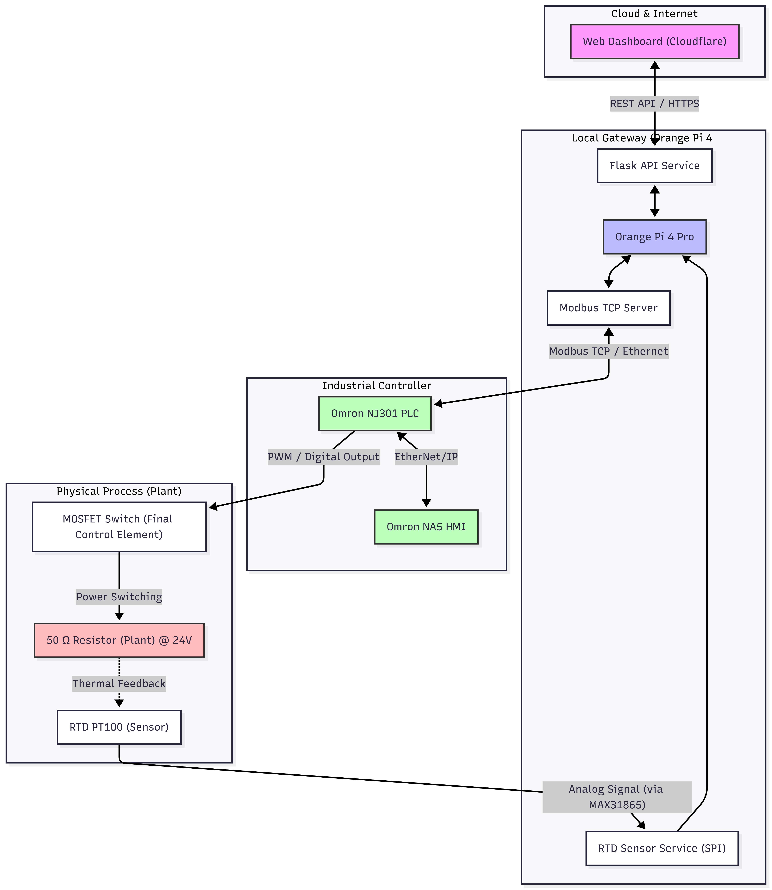

# Lab 4: PID Tuning - Open-Loop Transient Response Method

## Objective
The goal of this lab is to determine the PID parameters ($K_p$, $T_i$, $T_d$) of a temperature control system using the **Open-Loop Transient Response Method** (also known as the **Process Reaction Curve Method**).

---

## Lab Setup & Remote Architecture

Before starting the experiment, it is important to understand how your commands reach the physical hardware in the laboratory. This remote setup allows you to interact with industrial-grade equipment from anywhere.

### System Components:
1.  **Web Dashboard**: Your user interface for real-time monitoring and control.
2.  **Cloud Worker**: A secure bridge that routes your dashboard commands to the internal laboratory network.
3.  **Orange Pi Gateway**: The local controller that manages data flow between the web and the physical hardware.
4.  **Hardware Core**:
    *   **Omron NJ301 PLC**: Executes the actual PID control logic.
    *   **Radxa Camera**: Provides the live visual feedback of the thermal process.
    *   **ESP32 Smart Relay**: Manages the main power system for the laboratory equipment.

---

## 1. Background: The Open-Loop Technique
In an open-loop test, the controller is set to **Manual Mode**. A sudden step change is applied to the Manipulated Variable (MV), and the resulting response of the Process Variable (PV) is recorded.

### Why find the max temperature at 100% MV?
Yes, it is important to know the steady-state value at maximum output. This tells you the **Process Gain ($K$)**:
$$K = \frac{\Delta PV_{max}}{\Delta MV_{max}}$$
Knowing the full range of the process helps in normalizing the response and understanding the physical limits of your system.

---

## 2. Experimental Measurement Task

Follow these steps carefully to ensure your remote session is functional and to capture the data required for your PID calculations.

### Phase A: System Readiness Check
1.  **Dashboard Overview**: Familiarize yourself with the interface shown below.
    
2.  **Verify Connectivity**: Look at the **System Status** badges. Both **Gateway** and **ESP32** must be <Badge bg="success">ALIVE</Badge>.
3.  **Troubleshooting**: If either is offline, the experiment cannot proceed. Please contact:
    *   📧 Email: **wong.kiing.ing@curtin.edu.my**
    *   📱 WhatsApp: **0128789001**

### Phase B: Powering Up
1.  **Process Power**: Click the **Start** button in the **Process Power** section to turn on the main rig.
2.  **Camera Wait**: It will take approximately **1 minute** for the camera status to change to <Badge bg="success">ALIVE</Badge>.
3.  **Light Test**: To confirm you have real-time control, use the **Light Control** buttons. Click **Start** and **Stop** and observe the video stream; you should see a tiny LED on the experiment rig turning on/off.

### Phase C: The Thermal Experiment
1.  **Enable PLC**: Click **Start** under **Web Control** to enable remote communication with the Omron PLC.
2.  **Manual Initialization**:
    *   Set the control mode to **Manual**.
    *   Input a value of **40** into the **Manual MV (%)** field and click **Start**.
    *   **Observation**: You will see the temperature rise. Physically, the heater MOSFET is turning ON for 40% of the cycle and OFF for 60% of the cycle.
3.  **Steady State**: Wait for the temperature (PV) to stabilize completely at this 40% level.
4.  **The Step Change**:
    *   Once stable, change the **Manual MV (%)** to **45** and click **Start**.
    *   Observe the response on the **Trend Chart**.
5.  **Data Export**: Wait for the temperature to stabilize at the new 45% level. Once the "S-curve" is fully captured, click **CSV** to download your experiment data.

### Phase D: Shutdown
1.  **Power Down**: Before logging off, click **Stop** in the **Process Power** section to safely shut down the equipment.
2.  **Logout**: Ensure you logout of the dashboard to end your session.

---

## 3. Calculations

### Process Reaction Rate ($N$)
The slope of the tangent line at the point of inflection is the **Process Reaction Rate ($N$)**.
$$N = \frac{\Delta PV}{\Delta \text{Time}}$$
*Note: Ensure your time units are consistent (usually seconds or minutes).*

### Dead Time ($L$)
The distance from the time the MV was changed to the time where the tangent line intersects the original steady-state PV value.

### Controller Settings (Ziegler-Nichols)

| Mode | Proportional Gain ($K_p$) | Integral Time ($T_i$) | Derivative Time ($T_d$) |
| :--- | :--- | :--- | :--- |
| **P** | $K_p = \frac{\Delta MV}{N \cdot L}$ | - | - |
| **PI** | $K_p = 0.9 \cdot \frac{\Delta MV}{N \cdot L}$ | $T_i = 3.33 \cdot L$ | - |
| **PID** | $K_p = 1.2 \cdot \frac{\Delta MV}{N \cdot L}$ | $T_i = 2 \cdot L$ | $T_d = 0.5 \cdot L$ |

*Where $\Delta MV$ is the magnitude of the step change (e.g., 5% if you went from 40% to 45%).*

---

## 4. Omron NJ301 PLC Implementation

> [!IMPORTANT]
> The Omron NJ301 CPU uses **Proportional Band ($PB$)** instead of **Gain ($K_p$)**.

### Conversion Formula
To enter your calculated $K_p$ into the Omron PLC, you must convert it to $PB$ using the following formula:
$$PB = \frac{100}{K_p}$$

*   **Higher Gain ($K_p$)** = **Lower Proportional Band ($PB$)** (more aggressive).
*   **Lower Gain ($K_p$)** = **Higher Proportional Band ($PB$)** (more conservative).

### Units Checklist
- **Proportional Band ($PB$)**: Percentage (%)
- **Integral Time ($T_i$)**: Usually seconds
- **Derivative Time ($T_d$)**: Usually seconds

---

## 5. Summary Checklist for Students
1. [ ] Reach steady state at 40% MV.
2. [ ] Step to 45% MV.
3. [ ] Capture the "S-curve" in the trend chart.
4. [ ] Identify the tangent at the inflection point to find $N$ (slope) and $L$ (dead time).
5. [ ] Calculate $K_p$, $T_i$, and $T_d$.
6. [ ] Convert $K_p$ to $PB$ for the NJ301 PLC.
7. [ ] Test the calculated values in **Auto Mode** and observe the response.
