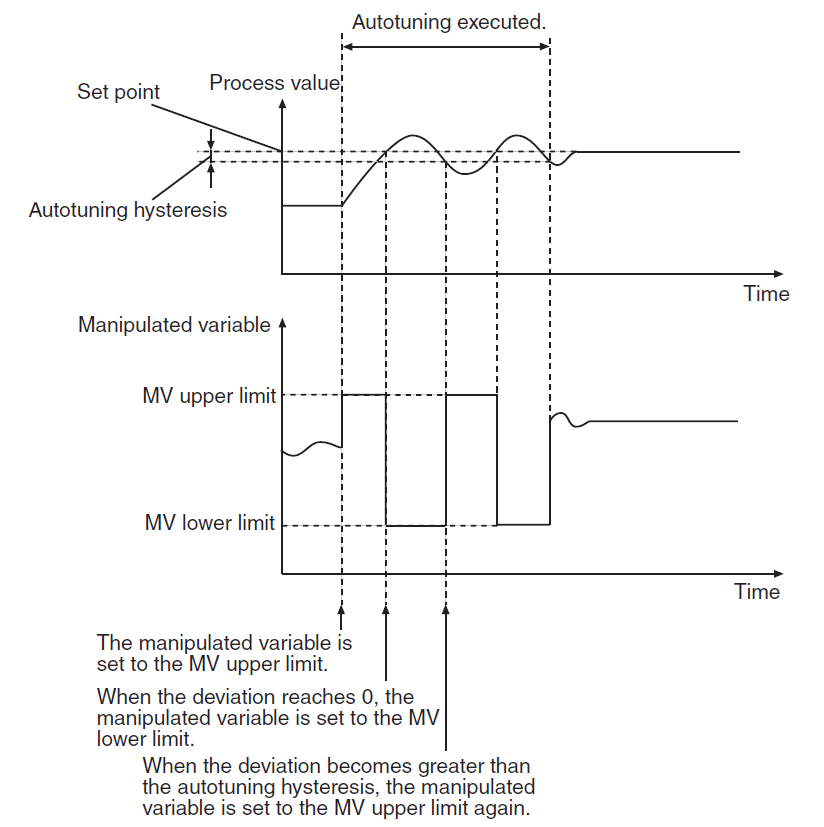
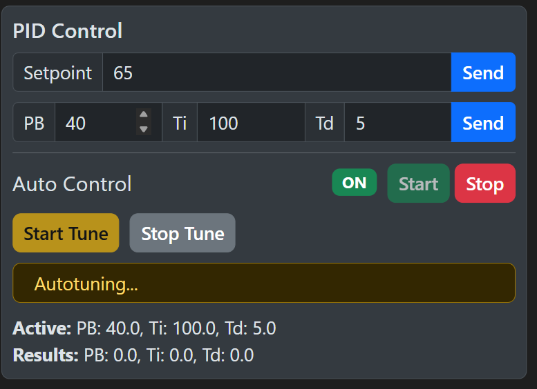
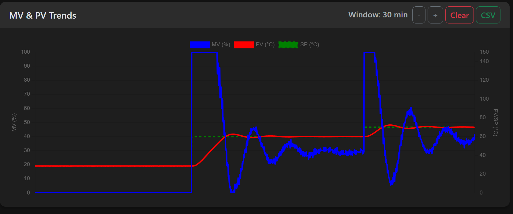

# Lab 5: PID Tuning - Autotuning and Fine-Tuning Method

## 1. Objective
The goal of this lab is to implement the **Omron NJ301 Autotuning (AT)** function to automatically determine PID parameters and then evaluate the system's performance during a larger temperature step change. Students will compare these "machine-calculated" values with their previous manual calculations from Lab 4.

---

## 2. Background

### 2.1 How Autotuning Works (The Limit Cycle Method)
Industrial controllers like the Omron NJ301 use a technique called the **Limit Cycle Method** for autotuning. Instead of relying on manual calculations, the controller "tests" the system by forcing the temperature to oscillate.

When you click **Start Tune**, the controller follows this logic:
1.  **Forcing a Response**: If your Setpoint (SP) is higher than the current Temperature (PV), the controller immediately sets the power (MV) to **100%**.
2.  **The Turning Point**: Once the temperature reaches the setpoint, the controller switches the power to **0%**.
3.  **The Cycle**: As the temperature drops back down below the setpoint (after a small buffer called hysteresis), the controller turns the power back to **100%**.
4.  **Calculation**: The controller repeats this cycle **twice**. By measuring the time between these peaks and the size of the temperature waves, it can mathematically determine the perfect PID constants for your specific setup.

### 2.2 Why we stabilize at 60°C first?
Autotuning requires a clear "starting line." By stabilizing at 60°C and then moving the Setpoint to 65°C before clicking **Start Tune**, we ensure two things:
-   The system is in a known, steady state.
-   There is a sufficient **error** (the 5°C difference) for the controller to begin the 100% power "push" required for the Limit Cycle Method.

---

## 3. Measurement Tasks

### 3.1 Powering Up and Initialization
1.  **Process Power**: Click **Start** in the Process Power section.
2.  **Verify Status**: Ensure **Gateway**, **Camera**, and **ESP32** are all **ALIVE**.
3.  **Web Control**: Click **Start** to enable communication with the PLC.

### 3.2 System Setup (Using Lab 4 Parameters)
1.  **Mode**: Switch the system to **Tune Mode**.
2.  **Initial Values**: Input your final $PB$, $T_i$, and $T_d$ values calculated from **Lab 4** and click **Send**.
3.  **Base Stabilization**: Set the **Setpoint (SP)** to **60°C** and click **Start**. Wait until the temperature is completely stable.

### 3.3 The Autotuning Process
1.  **Prepare for Tune**: Increase the **Setpoint (SP)** to **65°C**.
2.  **Activate AT**: Click the **Start Tune** button on the dashboard.
    *   The system will enter a specialized tuning mode.
    *   Observe the "Autotuning..." status message on the dashboard.
    
3.  **Wait for Completion**: Do not change any settings while the tune is active. 
    *   **Note**: If you need to cancel the process, click **Stop Tune**. The tuning process will stop, and the controller will return to its previous feedback control state.
    *   The process is complete when the "Tune Complete" alert appears and the status resets.
4.  **Review Results**: Once complete, the controller will automatically stop the oscillation and output the final **Results** (PB, Ti, Td).
    *   **Important**: You must manually enter these new values into the dashboard PID fields and click **Send** to update the controller.
    *   **Action**: Note these values down manually for your report. 
    *   **Note**: You do **not** need to download a CSV file for the autotuning oscillation phase.

### 3.4 Implementation and Performance Verification
1.  **Update Controller**: Input the autotuned $PB$, $T_i$, and $T_d$ results into the PID input fields on the dashboard.
2.  **Apply**: Click **Send** to transmit these new values to the PLC.
3.  **Reset Temperature**: Set the **Setpoint (SP)** back to **60°C** and click **Start**. Wait for full stabilization.
4.  **The Stress Test**: Once stable at 60°C, change the **Setpoint (SP)** to **70°C** and click **Start**.
    
5.  **Data Capture**: Observe the transient response on the chart. 
6.  **Export**: Once the temperature has stabilized at 70°C, click **CSV** to download the data for your report.

---

## 4. Post-Laboratory Task

### 4.1 Response Comparison
1.  **Plotting**: Create a chart showing the transition from 60°C to 70°C using the autotuned parameters.
2.  **Metric Analysis**: Calculate the following for the 70°C step:
    - **Overshoot (%)**
    - **Rise Time (s)**
    - **Settling Time (s)**
3.  **Discussion**: 
    - **Comparison**: Compare these metrics with your Lab 4 results. You may notice that both ZN (manual) and Autotune (automated) often produce aggressive responses with some overshoot.
    - **Performance**: Which method reached the setpoint faster (Rise Time)? Which one reached stability sooner (Settling Time)?
    - **Reducing Overshoot**: If the overshoot observed in this experiment is too high for a sensitive industrial process, how would you manually adjust the $PB$ and $T_i$ parameters to achieve a smoother response?

---

## 5. Summary Checklist
1. [ ] Stabilize at 60°C using Lab 4 PID parameters.
2. [ ] Step to 65°C and run **Start Tune**.
3. [ ] Record the Autotune results and **Send** them to the PLC.
4. [ ] Stabilize back at 60°C.
5. [ ] Perform a step change to 70°C and download the **CSV** data.
6. [ ] Compare Lab 4 (Manual) vs Lab 5 (Autotune) performance.
