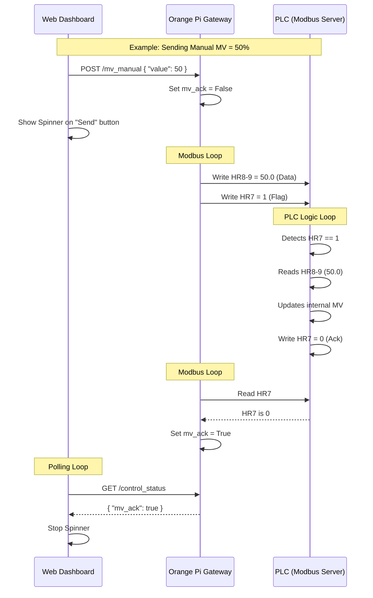

# Gateway <-> PLC Handshake Protocol

This document explains the "Write & Acknowledge" handshake protocol used between the **Orange Pi Gateway** and the **PLC** (via Modbus TCP).

## The Concept

To ensure data integrity and command confirmation, simple "fire and forget" Modbus writes are not used for critical parameters. Instead, a **Handshake Flag** mechanism is used.

### The 3-Step Process

1.  **Gateway Initiates (Request)**
    *   The Gateway writes the **Data Value** to the Data Registers (e.g., HR8-9).
    *   The Gateway writes `1` to the **Handshake Flag Register** (e.g., HR7).
    *   *State: Update Pending.*

2.  **PLC Processes (Action)**
    *   The PLC scans the Flag Register.
    *   When it sees the Flag is `1`:
        *   It reads the Data Registers.
        *   It updates its internal variables.
        *   It writes `0` back to the **Handshake Flag Register**.
    *   *State: Action Taken.*

3.  **Gateway Confirms (Acknowledge)**
    *   The Gateway polls the Flag Register.
    *   When it sees the Flag has returned to `0`:
        *   It knows the PLC has received and applied the value.
        *   It updates the UI status to "Acknowledged" (stopping any spinners).

---

## Visual Diagram

---

## Handshake Register Map

This protocol applies to the following commands.

| Command | Flag Register | Data Registers | Description |
| :--- | :--- | :--- | :--- |
| **Manual MV** | **HR7** | **HR8-9** | Manual Output % (0-100) |
| **PID Params** | **HR10** | **HR11-16** | PB, Ti, Td settings |
| **Setpoint** | **HR17** | **HR18-19** | Temperature Target |
| **Tune Setpoint**| **HR24** | **HR18-19** | Temp Target *during* Auto-Tune |
| **Tune Start** | **HR25** | - | Command to start Auto-Tune |
| **Tune Stop** | **HR26** | - | Command to stop Auto-Tune |

### Why use this?
*   **Reliability**: It prevents the PLC from reading "half-written" floats (since Modbus registers are 16-bit and floats are 32-bit).
*   **Feedback**: The user knows for sure that the PLC accepted the value.
