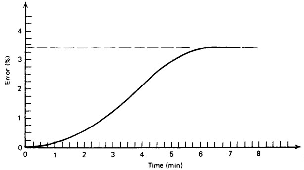
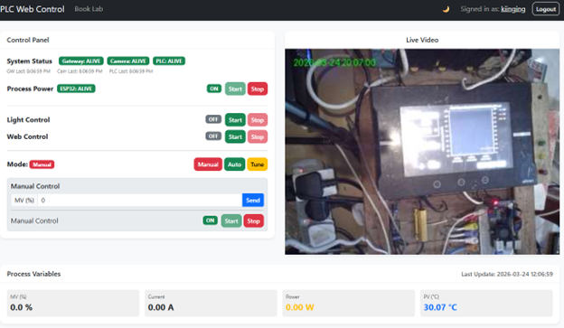

# Lab 4: PID Tuning - Open-Loop Transient Response Method

## 1. Objective
The goal of this lab is to determine the PID parameters ($K_p$, $T_i$, $T_d$) of a temperature control system using the **Open-Loop Transient Response Method** (also known as the **Process Reaction Curve Method**).

---

## 2. Pre-lab Task (10 marks)

**Instructions**: Complete these tasks before your scheduled lab session. Show your working clearly.

### 2.1 Proportional Controller Analysis (5 Marks)
A proportional controller has a proportional gain, **$K = 2.0$**, and a bias, **$p = 0.5$**. 
Determine the controller output ($P$) over time when the error signal shown below is inputted to the controller.

*Recall the formula: $P = K \cdot e + p$*

### 2.2 Theoretical ZN Tuning (5 Marks)
An open-loop step response of a process is given in the figure below when a step change of **7.5%** in the control variable (MV) is applied.

Using the Open-Loop Transient Response Method, determine the appropriate parameters for a **PID Controller** (i.e., $K_p$, $T_i$, and $T_d$).

---

## 3. Background

### 3.1 Lab Setup & Remote Architecture
Before starting the experiment, it is important to understand how your commands reach the physical hardware in the laboratory. This remote setup allows you to interact with industrial-grade equipment from anywhere.

**System Components**:
- **Web Dashboard**: Your user interface for real-time monitoring and control.
- **Cloud Worker**: A secure bridge that routes your dashboard commands.
- **Orange Pi Gateway**: Centrally manages data flow locally.
- **Hardware Core**: Omron NJ301 PLC, Radxa Camera, and ESP32 Smart Relay.

### 3.2 The Open-Loop Technique
In an open-loop test, the controller is set to **Manual Mode**. A sudden step change is applied to the Manipulated Variable (MV), and the resulting response of the Process Variable (PV) is recorded.

### 3.3 Understanding Process Gain ($K$)
- **0% MV** leads to a steady-state temperature of **27°C** (Ambient).
- **100% MV** leads to a steady-state temperature of **130°C**.
- **Process Gain ($K$)**: $K = \frac{\Delta PV}{\Delta MV}$
- Knowing the full range (**103°C**) helps in normalizing the response.

---

## 4. Measurement Tasks

### 4.1 System Readiness Check
1.  **Dashboard Overview**: Familiarize yourself with the interface shown below.
    
2.  **Verify Connectivity**: Look at the **System Status** badges. Both **Gateway** and **ESP32** must be **ALIVE**.
3.  **Troubleshooting**: Contact: `wong.kiing.ing@curtin.edu.my` or WhatsApp `0128789001`.

### 4.2 Powering Up
1.  **Process Power**: Click **Start** in the Process Power section.
2.  **Camera**: It takes ~1 minute for the camera to come online.
3.  **Light Test**: Toggle the **Light Control** while watching the video to confirm real-time control.

### 4.3 Thermal Experiment
1.  **Web Control**: Click **Start** to enable PLC communication.
2.  **Manual Initialization**: Set mode to **Manual** and MV to **40%**.
3.  **Steady State**: Wait for the temperature to stabilize at 40% MV.
4.  **The Step Change**: Change MV to **45%** (a 5% step) and click **Start**.
5.  **Data Export**: Wait for stabilization at 45% MV, then click **CSV** to download the data.

### 4.4 PID Controller Verification (Auto Mode)
1.  **Parameter Entry**: Switch the system to **Auto Mode**.
2.  **Input Tuning Values**: Enter your calculated $PB$, $T_i$, and $T_d$ values into the PID controller fields on the dashboard.
3.  **Initial Stabilization**: Set the **Set-point (SP)** to **50°C** and wait for the PV to reach and settle at this value.
4.  **Transient Response Test**: Once stable, change the **Set-point (SP)** to **60°C** and click **Start**.
5.  **Record Performance**: Observe the temperature graph. Ensure you capture the entire transition from 50°C to 60°C. Download the **CSV** once the system has stabilized at the new set-point.

---

## 5. Post Laboratory Task (10 marks)

### 5.1 Processing the recorded data (5 Marks)
1.  **Time Conversion**: Open your CSV in Excel. Column A contains the timestamps. To calculate elapsed time in seconds, subtract the first timestamp from the current one and multiply by 86,400 (the number of seconds in a day).
    *   *Example Formula in Column E:* `=(A2 - $A$2) * 86400`
2.  **Signal Smoothing**: The temperature sensor is sensitive. Use a 100-sample moving average on the **PV (Column B)** to smooth the signal for your analysis.
    *   *Example Formula in Column F:* `=AVERAGE(B2:B101)`
3.  **Trend Plotting**: Create a single line chart showing both the **Temperature (PV)** and the **Manipulated Variable (MV)** from Column D. 
    *   *Pro-Tip*: Since MV is 0-100% and Temperature can reach 130°C, use a **Secondary Y-Axis** for the Temperature to ensure both curves are clearly visible.

### 5.2 Determination of PID control parameters (5 Marks)
1.  **S-Curve Analysis**: Using your smoothed plot, identify the inflection point. Draw a tangent line to determine the **Dead Time ($L$)** and the **Reaction Rate ($N$)**.
2.  **System Response**: Express the change in temperature ($\Delta PV$) and the change in power ($\Delta MV$) as percentages of their full ranges (103°C and 100% respectively).
3.  **ZN Tuning**: Use the Ziegler-Nichols Open-Loop formulas to calculate the final values for $K_p, T_i,$ and $T_d$.

### 5.3 Transient Response Analysis (5 Marks)
1.  **Plotting the Step Change**: Using the data from Task 4.4, plot the **PV (Temperature)** and **SP (Set-point)** on the same graph as the system moves from 50°C to 60°C.
2.  **Performance Metrics**: On your plot, identify and label the following:
    - **Overshoot**: The maximum value minus the set-point.
    - **Rise Time**: Time taken for the temperature to first reach 60°C.
    - **Settling Time**: Time taken for the response to stay within ±2% of the final value.
3.  **Discussion**: Compare the observed response with what you expected from your ZN parameters. Is the system stable? Is the overshoot acceptable?

---

## 6. Omron NJ301 PLC Implementation

### 6.1 PLC Conversion
The PLC uses **Proportional Band ($PB$)**. Convert your calculated $K_p$ using:
$$PB = \frac{100}{K_p}$$

### 6.2 Summary Checklist
1. [ ] Reach steady state at 40% MV.
2. [ ] Step to 45% MV and capture S-curve data.
3. [ ] Calculate $K_p, T_i, T_d$ and convert to $PB, T_i, T_d$.
4. [ ] In **Auto Mode**, stabilize at 50°C SP.
5. [ ] Perform SP step change to 60°C and record transient response.
